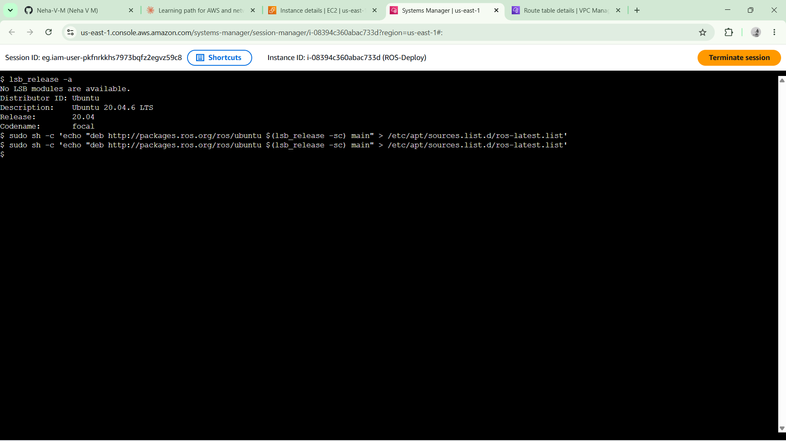
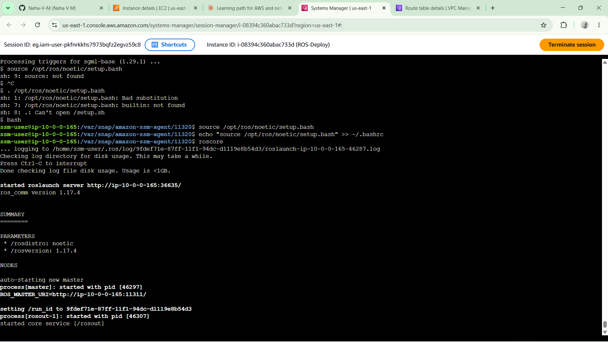
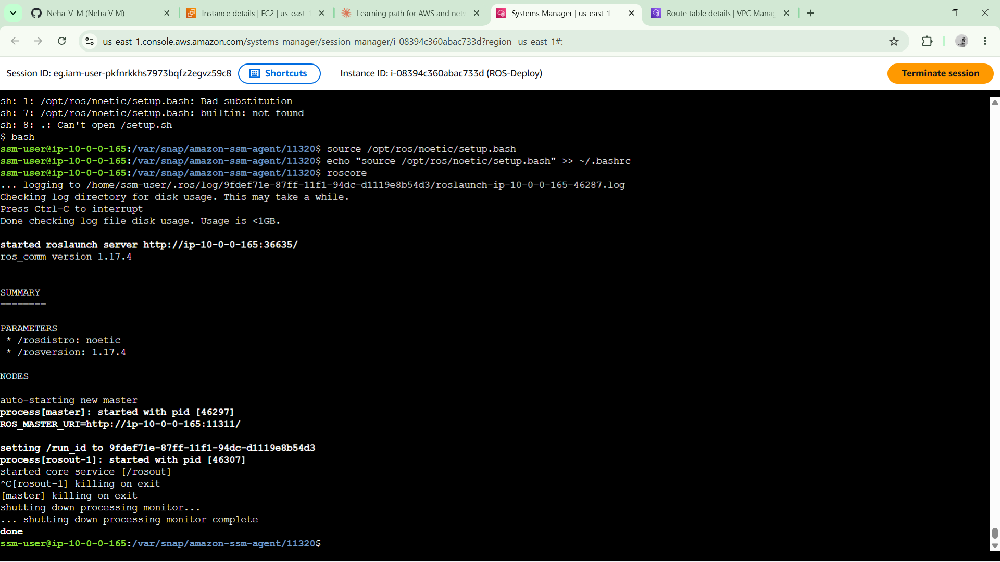
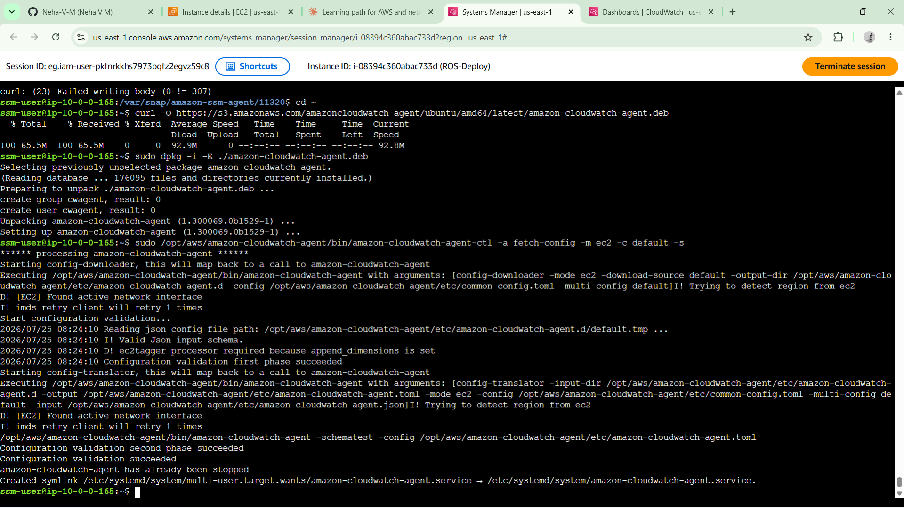
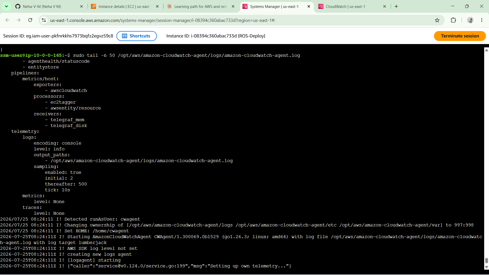
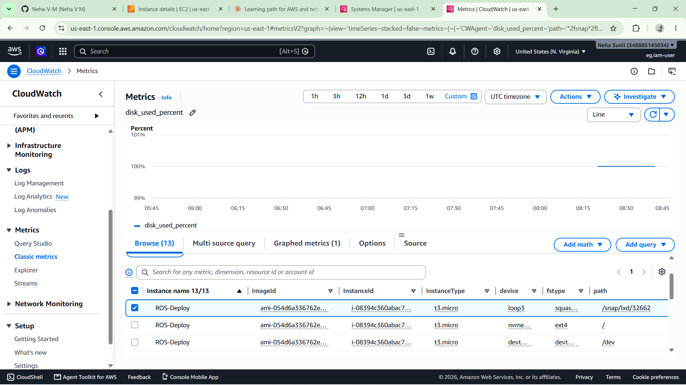

# Deploy ROS Noetic on AWS EC2 with CloudWatch Monitoring

A hands-on cloud project deploying **ROS (Robot Operating System) Noetic** on an AWS EC2 instance, with **CloudWatch monitoring** configured to track instance memory and disk usage.

---

## Overview

**Scenario:** Working as a software engineer at a company building robotics software, tasked with deploying ROS Noetic on the cloud so developers can run robotic simulations remotely instead of needing local hardware.

This project sets up:

- An EC2 instance running **Ubuntu 20.04 LTS** (the specific OS version ROS Noetic requires)
- A full **ROS Noetic Desktop-Full** installation (including simulators and perception packages)
- A working **roscore** verification (ROS's master process, confirming the installation functions correctly)
- The **CloudWatch Agent**, configured to report memory and disk metrics that EC2 doesn't track by default

---

## Architecture

```text
Internet
    │
    ▼
VPC (Public Subnet)
    │
    ▼
┌────────────────────────────┐
│ EC2 Instance               │
│ Ubuntu 20.04 LTS           │
│ ROS Noetic                 │
│ t3.micro                   │
└─────────────┬──────────────┘
              │
              ▼
      CloudWatch Agent
(mem_used_percent, disk_used_percent)
              │
              ▼
      Amazon CloudWatch
     (CWAgent namespace)
```

---

## Tech Stack

- **AWS EC2** – Ubuntu 20.04 LTS (t3.micro)
- **ROS Noetic** – Robotics middleware (Desktop-Full)
- **Amazon CloudWatch** – Monitoring and metrics
- **AWS IAM** – Role-based access
- **AWS Systems Manager (Session Manager)** – Key-free instance access

---

## Setup Steps

1. Located and launched an EC2 instance using the official **Canonical Ubuntu 20.04 LTS (Focal)** AMI.
2. Configured the instance with **30 GB storage** and attached an IAM role providing:
   - Systems Manager access
   - CloudWatch Agent permissions
3. Connected using **Session Manager** and verified the OS with:

   ```bash
   lsb_release -a
   ```

4. Added the ROS repository and GPG key.
5. Installed:

   ```bash
   sudo apt install ros-noetic-desktop-full
   ```

6. Sourced the ROS environment and made it persistent via `.bashrc`.
7. Verified the installation by successfully running:

   ```bash
   roscore
   ```

8. Installed and configured the **Amazon CloudWatch Agent**.
9. Verified:
   - Agent status locally
   - Memory and disk metrics appearing in the **CWAgent** namespace in CloudWatch

---

## Challenges & Debugging

### Ubuntu 20.04 AMI Not in Quick Start

Ubuntu 20.04 no longer appeared in the EC2 Quick Start AMIs because AWS periodically rotates the available versions.

**Solution:** Browsed manually under **Browse More AMIs** and selected the official Canonical image after verifying the owner ID.

---

### t2.micro Unavailable

The account couldn't launch a **t2.micro** instance.

**Solution:** Used **t3.micro**, which provides the same 1 vCPU / 1 GB RAM specification with newer hardware.

---

### ROS Environment Wouldn't Source

Running

```bash
source /opt/ros/noetic/setup.bash
```

failed because the terminal was running under **sh/dash** instead of **bash**.

**Solution:** Switched to Bash before sourcing the environment.

---

### CloudWatch Agent Download Permission Error

Running

```bash
curl -O ...
```

failed because the current directory wasn't writable.

**Solution:** Changed to the home directory first:

```bash
cd ~
```

---

### Verifying CloudWatch Agent

The default EC2 monitoring graphs (CPU and Network) do **not** confirm the CloudWatch Agent is working.

**Solution:** Navigated to the **CWAgent** namespace under **CloudWatch → Metrics → All metrics → CWAgent** and confirmed memory and disk metrics were being reported.

---

## Project Notes

See **Project2_Notes_ROS_CloudWatch.md** for the complete step-by-step documentation.

---

## Screenshots

### Ubuntu Version



### ROS Core Verification





### CloudWatch Agent Status





### CloudWatch Metrics


